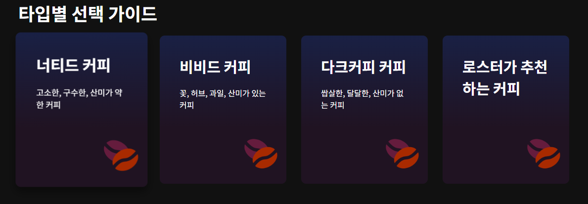

# 학습일지 (daily-log.md)

## 작성자

* 이름: 장호균

---

## 2026-06-23

### 오늘 수업때 공부한 것들
1)  HTML / CSS
    - 원두정기구독 웹페이지 만들기 
    - link로 CSS 파일 <-> index 연결, 폰트 어썸 연결하기
    - 기본 구조 구성 (이번 원두정기구독 HTML기본 뼈대)
        - header(헤더영역)
        - banner(배너)
        - membership(멤버십)
        - choice(타입별 선택 가이드)
        - FAQ 아코디언
        - footer
### 비고 (생각 및 집에서 할 일)

-  & nbsp; 공백의 키(공백없이 사용)
- 이번 학습을 배우면서 어제 배운 트랜지션 (hover)를 이용해서 코드를 추가하여 타입별 선택 가이드에 
  마우스를 가져다 대면 화면이 커지는것을 유도 해서 조금 더 선택한것을 볼수 있도록 유도 했습니다.
